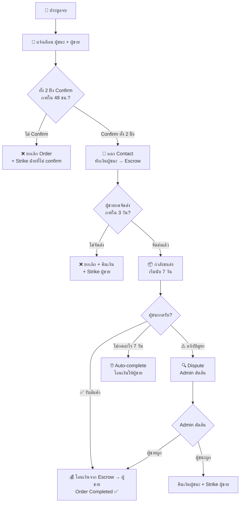

# Post-Auction Feature — สรุป Flow ทั้งหมด

**อัปเดตล่าสุด:** 15 ก.พ. 2026

## ภาพรวม

Feature นี้จัดการ **ทุกอย่างหลังประมูลจบ** ตั้งแต่แจ้งเตือน → ยืนยัน → แลก contact → จัดส่ง → รับของ → โอนเงิน

---

## Flow หลัก



---

## รายละเอียดแต่ละขั้นตอน

### 1. ประมูลจบ → แจ้งเตือน
- Notification ไปหา**ผู้ชนะ** + **ผู้ขาย**
- ทั้ง 2 ฝั่งมี **48 ชั่วโมง** ในการ Confirm

### 2. Confirm + กรอกข้อมูลติดต่อ

| Field | Required | ตัวอย่าง |
|-------|----------|---------|
| เบอร์โทร | ✅ required | 081-xxx-xxxx |
| LINE ID | optional | @myline |
| Facebook | optional | fb.com/myname |
| ข้อความเพิ่มเติม | optional | "ติดต่อหลัง 6 โมง" |

### 3. แลก Contact + Escrow
- ทั้ง 2 confirm แล้ว → **เปิดเผย contact ให้กันและกัน**
- **หักเงินจาก wallet ผู้ชนะ** → เก็บไว้ใน escrow (pending)
- ถ้าเงินไม่พอ → ยกเลิก order + แจ้งเตือนทั้ง 2 ฝั่ง

### 4. จัดส่งสินค้า
- ผู้ขายกด **"จัดส่งแล้ว"** (ภายใน 3 วัน)
- สถานะเปลี่ยนเป็น **"shipped"**
- เริ่มนับ **7 วัน** สำหรับ auto-complete

### 5. รับสินค้า
ผู้ชนะมี 2 ตัวเลือก:
- ✅ **"รับสินค้าแล้ว"** → เงินจาก escrow → wallet ผู้ขาย → จบ
- ⚠️ **"แจ้งปัญหา"** → Dispute (เขียนเหตุผล + แนบรูปสูงสุด 5 รูป)

### 6. Auto-complete (7 วัน) — Phase 2
- ถ้าผู้ชนะ**ไม่กดอะไร**ภายใน 7 วันหลังจัดส่ง
- ระบบ **auto-complete** → โอนเงินให้ผู้ขาย

---

## ระบบ Escrow (เงิน)

```
ผู้ชนะ Confirm (ทั้ง 2 ฝั่ง confirm แล้ว):
  wallet.balance_available  -= amount
  wallet.balance_pending    += amount  (hold)

ผู้ชนะกดรับ / Auto-complete:
  buyer.balance_pending     -= amount
  buyer.balance_total       -= amount
  seller.balance_available  += amount
  seller.balance_total      += amount

Dispute (ผู้ชนะชนะ):
  buyer.balance_pending     -= amount
  buyer.balance_available   += amount  (คืน)
```

---

## ระบบ Strike + แบน

| เหตุการณ์ | ใครโดน | Strike |
|----------|-------|--------|
| ไม่ Confirm ใน 48 ชม. | ฝ่ายที่ไม่กด | +1 |
| ไม่จัดส่งใน 3 วัน | ผู้ขาย | +1 |
| Dispute แพ้ | ฝ่ายที่ผิด | +1 |

- **3 strikes** → แบนจากการประมูล **7 วัน**

---

## Order Status

```
pending_confirm → confirmed → shipped → completed
                                      → disputed → resolved
              → cancelled (timeout)
```

---

## Time Limits

| ขั้นตอน | เวลา | ถ้าหมดเวลา |
|---------|------|-----------|
| Confirm | 48 ชม. | ยกเลิก + strike |
| จัดส่ง | 3 วัน | ยกเลิก + คืนเงิน + strike ผู้ขาย |
| กดรับสินค้า | 7 วัน | Auto-complete + โอนเงินให้ผู้ขาย |
