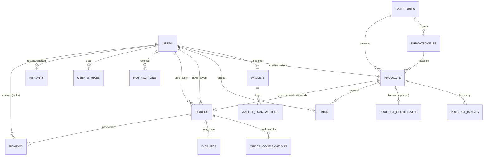

# 🗄 Database Documentation — BidKhong Auction API

**DBMS:** MySQL 8.0 (Docker) · **ORM:** Laravel Eloquent · **Timezone:** Asia/Bangkok
**อัปเดตล่าสุด:** 21 กุมภาพันธ์ 2026

---

## 📊 ภาพรวม Database

| รายการ | จำนวน |
|--------|-------|
| Application Tables | 15 |
| System/Framework Tables | 5 |
| Total Tables | 20 |
| Migration Files | 26 |
| Foreign Keys | 23 |
| UNIQUE Constraints | 4 |
| ENUM Columns | 8 |

---

## 🗂 สารบัญตาราง

| # | ตาราง | ประเภท | คำอธิบายสั้น |
|---|-------|--------|-------------|
| 1 | users | Core | ผู้ใช้งานทั้งหมด (buyer, seller, admin) |
| 2 | wallets | Core | กระเป๋าเงินจำลอง (1 user = 1 wallet) |
| 3 | wallet_transactions | Core | ประวัติธุรกรรมทุกรายการ |
| 4 | products | Core | สินค้าประมูล |
| 5 | product_images | Core | รูปสินค้าเพิ่มเติม (multiple images) |
| 6 | product_certificates | Core | ใบรับรองสินค้าของแท้ |
| 7 | categories | Core | หมวดหมู่หลัก (6 หมวด) |
| 8 | subcategories | Core | หมวดหมู่ย่อย (36 หมวดย่อย) |
| 9 | bids | Core | การประมูล (ราคา, สถานะ) |
| 10 | orders | Post-Auction | คำสั่งซื้อหลังประมูลจบ |
| 11 | order_confirmations | Post-Auction | ข้อมูลติดต่อ buyer/seller |
| 12 | disputes | Post-Auction | แจ้งปัญหาสินค้า |
| 13 | user_strikes | Post-Auction | บันทึกการลงโทษ/แบน |
| 14 | reviews | Post-Auction | รีวิว/คะแนนผู้ขาย |
| 15 | reports | Admin | รายงานปัญหาทั่วไป |
| 16 | notifications | System | แจ้งเตือน in-app |
| 17 | personal_access_tokens | Framework | Sanctum auth tokens |
| 18 | password_reset_tokens | Framework | Reset password tokens |
| 19 | sessions | Framework | Session storage |
| 20 | cache/jobs | Framework | Queue & cache |

---

## 📋 รายละเอียดทุกตาราง

---

### 1. `users` — ผู้ใช้งาน

| Column | Type | Nullable | Default | Key | คำอธิบาย |
|--------|------|----------|---------|-----|----------|
| `id` | BIGINT UNSIGNED | ❌ | AUTO_INCREMENT | **PK** | รหัสผู้ใช้ |
| `name` | VARCHAR(255) | ❌ | — | | ชื่อผู้ใช้ |
| `email` | VARCHAR(255) | ❌ | — | **UNIQUE** | อีเมล (ใช้ login, ห้ามซ้ำ) |
| `phone_number` | VARCHAR(255) | ❌ | — | **UNIQUE** | เบอร์โทรศัพท์ (ห้ามซ้ำ) |
| `email_verified_at` | TIMESTAMP | ✅ | NULL | | วันยืนยันอีเมล |
| `password` | VARCHAR(255) | ❌ | — | | รหัสผ่าน (bcrypt hash, 60 chars) |
| `join_date` | TIMESTAMP | ❌ | CURRENT_TIMESTAMP | | วันสมัคร |
| `role` | ENUM('user','admin') | ❌ | 'user' | | บทบาท |
| `profile_image` | VARCHAR(255) | ✅ | NULL | | path รูปโปรไฟล์ |
| `remember_token` | VARCHAR(100) | ✅ | NULL | | Remember me token |
| `created_at` | TIMESTAMP | ✅ | NULL | | Laravel auto |
| `updated_at` | TIMESTAMP | ✅ | NULL | | Laravel auto |

**Constraints:**
- `email` UNIQUE — ไม่สามารถสมัคร 2 บัญชีด้วยอีเมลเดียวกัน
- `phone_number` UNIQUE + NOT NULL — ป้องกัน fake accounts, ใช้ยืนยันตัวตน
- `password` เก็บเป็น bcrypt hash — ไม่สามารถถอดรหัสกลับเป็น plaintext ได้

**Security Notes:**
- `password` → bcrypt (cost 10, output 60 chars)
- `remember_token` → random 100 chars, ใช้สำหรับ "remember me" feature
- `role` เป็น ENUM ป้องกันค่าที่ไม่ถูกต้อง (เช่น injection ค่า 'superadmin')

---

### 2. `wallets` — กระเป๋าเงิน

| Column | Type | Nullable | Default | Key | คำอธิบาย |
|--------|------|----------|---------|-----|----------|
| `id` | BIGINT UNSIGNED | ❌ | AUTO_INCREMENT | **PK** | |
| `user_id` | BIGINT UNSIGNED | ❌ | — | **FK → users.id** | เจ้าของ |
| `balance_available` | DECIMAL(10,2) | ❌ | 0.00 | | เงินที่ใช้ได้ทันที |
| `balance_total` | DECIMAL(10,2) | ❌ | 0.00 | | ยอดรวม (available + pending) |
| `balance_pending` | DECIMAL(10,2) | ❌ | 0.00 | | เงินที่ถูกกัน (กำลัง bid/escrow) |
| `withdraw` | DECIMAL(10,2) | ❌ | 0.00 | | ยอดถอนสะสม |
| `deposit` | DECIMAL(10,2) | ❌ | 0.00 | | ยอดเติมสะสม |
| `w_time` | TIMESTAMP | ✅ | NULL | | เวลาอัปเดตล่าสุด |
| `created_at` | TIMESTAMP | ✅ | NULL | | |
| `updated_at` | TIMESTAMP | ✅ | NULL | | |

**Constraints:**
- `user_id` → FK ON DELETE CASCADE
- **1 User : 1 Wallet** (One-to-One)

**สูตรคำนวณ (Denormalized):**
```
balance_total = balance_available + balance_pending
```
> ⚡ `balance_total` เป็น **derived value** (คำนวณจาก available + pending ได้) เลือกเก็บเป็น column เพื่อ query เร็วขึ้น ไม่ต้องคำนวณทุกครั้ง — เป็น **intentional denormalization** เพื่อ performance

---

### 3. `wallet_transactions` — ประวัติธุรกรรม

| Column | Type | Nullable | Default | Key | คำอธิบาย |
|--------|------|----------|---------|-----|----------|
| `id` | BIGINT UNSIGNED | ❌ | AUTO_INCREMENT | **PK** | |
| `user_id` | BIGINT UNSIGNED | ❌ | — | **FK → users.id** | เจ้าของ |
| `wallet_id` | BIGINT UNSIGNED | ❌ | — | **FK → wallets.id** | กระเป๋าเงิน |
| `type` | ENUM (9 values) | ❌ | — | | ประเภทธุรกรรม |
| `amount` | DECIMAL(12,2) | ❌ | — | | จำนวนเงิน (+ = เงินเข้า, - = เงินออก) |
| `description` | VARCHAR(255) | ✅ | NULL | | รายละเอียด |
| `reference_type` | VARCHAR(255) | ✅ | NULL | | Polymorphic: product/bid/order |
| `reference_id` | BIGINT UNSIGNED | ✅ | NULL | | ID อ้างอิง |
| `balance_after` | DECIMAL(12,2) | ❌ | — | | ยอดเงินหลังทำรายการ |
| `created_at` | TIMESTAMP | ✅ | NULL | | |
| `updated_at` | TIMESTAMP | ✅ | NULL | | |

**Transaction Types ENUM (9 ค่า):**

| Type | ทิศทาง | คำอธิบาย | เกิดตอนไหน |
|------|--------|----------|-----------|
| `topup` | + | เติมเงินเข้า wallet | AuthController::topUp |
| `withdraw` | - | ถอนเงินออก | AuthController::withdraw |
| `bid_placed` | - | หักเงินตอน bid (available → pending) | BidController::bid |
| `bid_refund` | + | คืนเงินตอนโดน outbid (pending → available) | BidController::bid |
| `auction_won` | - | หัก pending ตอนชนะประมูล | CloseExpiredAuctions / BidController::buyNow |
| `auction_sold` | + | รับเงินจากการขาย → seller wallet | CloseExpiredAuctions / PostAuctionController |
| `escrow_hold` | - | กันเงิน escrow ตอน buyer confirm order | PostAuctionController::confirm |
| `escrow_release` | - | ปล่อยเงิน escrow ให้ seller (หักจาก buyer pending) | PostAuctionController::receive |
| `escrow_refund` | + | คืนเงิน escrow ให้ buyer (dispute resolved) | AdminController::resolveDispute |

**Design: Polymorphic Reference**
- `reference_type` + `reference_id` ทำหน้าที่คล้าย FK แต่ชี้ไปได้หลาย table
- **เหตุผล:** transaction อ้างอิงได้ทั้ง product, bid, และ order → ถ้าใช้ FK ตรงต้องสร้าง 3 columns แยก
- **Trade-off:** DB ไม่ enforce referential integrity (ลบ order ตัว reference_id ยังค้าง)
- **Pattern:** เดียวกับที่ Laravel Sanctum ใช้ใน `personal_access_tokens` (tokenable_type + tokenable_id)

---

### 4. `products` — สินค้าประมูล

| Column | Type | Nullable | Default | Key | คำอธิบาย |
|--------|------|----------|---------|-----|----------|
| `id` | BIGINT UNSIGNED | ❌ | AUTO_INCREMENT | **PK** | |
| `user_id` | BIGINT UNSIGNED | ❌ | — | **FK → users.id** | ผู้ขาย (seller) |
| `category_id` | BIGINT UNSIGNED | ✅ | NULL | **FK → categories.id** | หมวดหมู่หลัก |
| `subcategory_id` | BIGINT UNSIGNED | ✅ | NULL | **FK → subcategories.id** | หมวดย่อย |
| `name` | VARCHAR(255) | ❌ | — | | ชื่อสินค้า |
| `description` | TEXT | ✅ | NULL | | รายละเอียด |
| `location` | VARCHAR(255) | ✅ | NULL | | สถานที่/จังหวัด |
| `picture` | VARCHAR(255) | ✅ | NULL | | รูปหลัก (storage path) |
| `starting_price` | DECIMAL(10,2) | ❌ | — | | ราคาเริ่มต้น |
| `bid_increment` | DECIMAL(10,2) | ❌ | — | | ขั้นต่ำต่อ bid (seller กำหนดเอง) |
| `current_price` | DECIMAL(10,2) | ❌ | — | | ราคาปัจจุบัน |
| `buyout_price` | DECIMAL(10,2) | ✅ | NULL | | ราคาซื้อทันที (Buy Now) |
| `auction_end_time` | TIMESTAMP | ❌ | — | | เวลาจบประมูล |
| `auction_start_time` | TIMESTAMP | ✅ | NULL | | เวลาเริ่มประมูล |
| `status` | ENUM('active','completed','cancelled') | ❌ | 'active' | | สถานะ |
| `created_at` | TIMESTAMP | ✅ | NULL | | |
| `updated_at` | TIMESTAMP | ✅ | NULL | | |

**Constraints:**
- `user_id` → FK ON DELETE **CASCADE** (ลบ user → ลบสินค้าทั้งหมด)
- `category_id` → FK ON DELETE **SET NULL** (ลบ category → สินค้ายังอยู่ แต่ไม่มีหมวด)
- `subcategory_id` → FK ON DELETE **SET NULL**

**ความสัมพันธ์ราคา:**
```
starting_price ≤ current_price ≤ buyout_price (if set)
minimum_bid = current_price + bid_increment
```

> ⚡ `current_price` เป็น **denormalized** — สามารถคำนวณจาก MAX(bids.price) ได้ แต่เก็บไว้เพื่อ performance (ไม่ต้อง JOIN + aggregate ทุกครั้ง)

**Computed Tag (Application Layer — ไม่เก็บใน DB):**

| Tag | เงื่อนไข | Priority |
|-----|---------|----------|
| `hot` | bids ≥ 10 | สูงสุด |
| `ended` | auction_end_time < now() | 2 |
| `ending` | active + เหลือ ≤ 6 ชม. | 3 |
| `incoming` | auction_start_time > now() | 4 |
| `default` | ที่เหลือทั้งหมด | ต่ำสุด |

---

### 5. `product_images` — รูปสินค้าเพิ่มเติม

| Column | Type | Nullable | Default | Key | คำอธิบาย |
|--------|------|----------|---------|-----|----------|
| `id` | BIGINT UNSIGNED | ❌ | AUTO_INCREMENT | **PK** | |
| `product_id` | BIGINT UNSIGNED | ❌ | — | **FK → products.id** | สินค้า |
| `image_url` | VARCHAR(255) | ❌ | — | | storage path ของรูป |
| `sort_order` | INT | ❌ | 0 | | ลำดับแสดง (0, 1, 2...) |
| `created_at` | TIMESTAMP | ✅ | NULL | | |
| `updated_at` | TIMESTAMP | ✅ | NULL | | |

**Constraint:** FK ON DELETE CASCADE (ลบสินค้า → ลบรูปด้วย)
**Design:** แยก table เพราะ 1 product มีรูปได้สูงสุด 8 รูป (1:N) — ถูกต้องตาม **1NF**

---

### 6. `product_certificates` — ใบรับรองสินค้า

| Column | Type | Nullable | Default | Key | คำอธิบาย |
|--------|------|----------|---------|-----|----------|
| `id` | BIGINT UNSIGNED | ❌ | AUTO_INCREMENT | **PK** | |
| `product_id` | BIGINT UNSIGNED | ❌ | — | **FK → products.id** | สินค้า |
| `file_path` | VARCHAR(255) | ❌ | — | | path ไฟล์ (PDF/รูป, max 10MB) |
| `original_name` | VARCHAR(255) | ❌ | — | | ชื่อไฟล์ต้นฉบับ |
| `status` | ENUM('pending','approved','rejected') | ❌ | 'pending' | | สถานะตรวจสอบ |
| `admin_note` | TEXT | ✅ | NULL | | หมายเหตุจาก admin |
| `verified_by` | BIGINT UNSIGNED | ✅ | NULL | **FK → users.id** | admin ที่ตรวจ |
| `verified_at` | TIMESTAMP | ✅ | NULL | | วันที่ตรวจ |
| `created_at` | TIMESTAMP | ✅ | NULL | | |
| `updated_at` | TIMESTAMP | ✅ | NULL | | |

**Constraints:**
- `product_id` → FK ON DELETE CASCADE
- `verified_by` → FK ON DELETE **SET NULL** (ลบ admin → ไม่ลบ certificate, แค่ไม่รู้ว่าใครตรวจ)
- **1 Product : 0..1 Certificate** (One-to-One, optional)

**Workflow:**
```
seller upload → status=pending → admin review → approved/rejected
approved → product ได้แท็ก "Certified" (is_certified accessor)
```

---

### 7. `categories` — หมวดหมู่หลัก

| Column | Type | Nullable | Default | Key | คำอธิบาย |
|--------|------|----------|---------|-----|----------|
| `id` | BIGINT UNSIGNED | ❌ | AUTO_INCREMENT | **PK** | |
| `name` | VARCHAR(255) | ❌ | — | | ชื่อหมวดหมู่ |
| `description` | TEXT | ✅ | NULL | | คำอธิบาย |
| `created_at` | TIMESTAMP | ✅ | NULL | | |
| `updated_at` | TIMESTAMP | ✅ | NULL | | |

**Seed Data (6 หมวด):** Electronics, Fashion, Collectibles, Home & Living, Vehicles, Others

---

### 8. `subcategories` — หมวดหมู่ย่อย

| Column | Type | Nullable | Default | Key | คำอธิบาย |
|--------|------|----------|---------|-----|----------|
| `id` | BIGINT UNSIGNED | ❌ | AUTO_INCREMENT | **PK** | |
| `category_id` | BIGINT UNSIGNED | ❌ | — | **FK → categories.id** | หมวดหลัก |
| `name` | VARCHAR(255) | ❌ | — | | ชื่อหมวดย่อย |
| `description` | TEXT | ✅ | NULL | | คำอธิบาย |
| `created_at` | TIMESTAMP | ✅ | NULL | | |
| `updated_at` | TIMESTAMP | ✅ | NULL | | |

**Constraint:** FK ON DELETE CASCADE (ลบ category → ลบ subcategory ทั้งหมด)
**Seed Data:** 36 หมวดย่อย (6 ต่อ category) เช่น Smartphones, Shoes, Art, Furniture, Cars ฯลฯ

---

### 9. `bids` — การประมูล

| Column | Type | Nullable | Default | Key | คำอธิบาย |
|--------|------|----------|---------|-----|----------|
| `id` | BIGINT UNSIGNED | ❌ | AUTO_INCREMENT | **PK** | |
| `user_id` | BIGINT UNSIGNED | ❌ | — | **FK → users.id** | ผู้ bid |
| `product_id` | BIGINT UNSIGNED | ❌ | — | **FK → products.id** | สินค้า |
| `price` | DECIMAL(10,2) | ❌ | — | | ราคาที่ bid |
| `time` | TIMESTAMP | ❌ | CURRENT_TIMESTAMP | | เวลาที่ bid |
| `status` | ENUM('active','outbid','won','lost') | ❌ | 'active' | | สถานะ |
| `created_at` | TIMESTAMP | ✅ | NULL | | |
| `updated_at` | TIMESTAMP | ✅ | NULL | | |

**Constraints:**
- `user_id` → FK ON DELETE CASCADE
- `product_id` → FK ON DELETE CASCADE

**Bid Status Flow (State Machine):**
```
active → outbid    (ถูกคนอื่น bid ทับ → ได้เงินคืนอัตโนมัติ)
active → won       (ชนะประมูล → สร้าง order)
outbid → lost      (ประมูลจบ ไม่ได้ชนะ)
active → lost      (buy-now ทำให้ประมูลปิดทันที)
```

**Business Rules:**
- `price` ≥ `products.current_price + products.bid_increment` (enforce ใน code)
- ห้าม bid สินค้าตัวเอง
- ห้าม bid ตอน auction หมดเวลา
- หักเงินจาก wallet ทันทีตอน bid (available → pending)

---

### 10. `orders` — คำสั่งซื้อ

| Column | Type | Nullable | Default | Key | คำอธิบาย |
|--------|------|----------|---------|-----|----------|
| `id` | BIGINT UNSIGNED | ❌ | AUTO_INCREMENT | **PK** | |
| `user_id` | BIGINT UNSIGNED | ❌ | — | **FK → users.id** | ผู้ซื้อ (buyer) |
| `product_id` | BIGINT UNSIGNED | ❌ | — | **FK → products.id** | สินค้า |
| `seller_id` | BIGINT UNSIGNED | ✅ | NULL | **FK → users.id** | ผู้ขาย (seller) |
| `final_price` | DECIMAL(10,2) | ❌ | — | | ราคาชนะ |
| `order_date` | TIMESTAMP | ❌ | CURRENT_TIMESTAMP | | วันสร้าง order |
| `status` | ENUM (7 values) | ❌ | 'pending_buyer_confirm' | | สถานะ |
| `buyer_confirmed_at` | TIMESTAMP | ✅ | NULL | | Buyer ยืนยัน |
| `shipped_at` | TIMESTAMP | ✅ | NULL | | Seller จัดส่ง |
| `received_at` | TIMESTAMP | ✅ | NULL | | Buyer รับของ |
| `confirm_deadline` | TIMESTAMP | ✅ | NULL | | Deadline ยืนยัน (48 ชม.) |
| `ship_deadline` | TIMESTAMP | ✅ | NULL | | Deadline จัดส่ง (3 วัน) |
| `receive_deadline` | TIMESTAMP | ✅ | NULL | | Deadline รับของ (7 วัน) |
| `created_at` | TIMESTAMP | ✅ | NULL | | |
| `updated_at` | TIMESTAMP | ✅ | NULL | | |

**Order Status ENUM (7 ค่า):**

| Status | คำอธิบาย | ขั้นตอนถัดไป |
|--------|----------|-------------|
| `pending_confirm` | legacy (deprecated) | |
| `pending_buyer_confirm` | รอ buyer ยืนยัน | → confirmed / cancelled |
| `confirmed` | buyer ยืนยันแล้ว, รอ seller จัดส่ง | → shipped |
| `shipped` | seller จัดส่งแล้ว | → completed / disputed |
| `completed` | buyer รับของแล้ว ✅ | จบ |
| `disputed` | มีปัญหา (buyer แจ้ง) | → resolved |
| `cancelled` | ยกเลิก | จบ |

**Order Status Flow (State Machine):**
```
pending_buyer_confirm → confirmed → shipped → completed ✅
        ↓                                  ↓
    cancelled                          disputed → resolved_buyer (คืนเงิน)
   (timeout 48h)                               → resolved_seller (จ่ายเงิน)
```

**Self-referencing FK:**
- `user_id` (buyer) → `users.id`
- `seller_id` (seller) → `users.id`
- 2 FK ชี้ไปตาราง `users` เดียวกัน — ใช้ `belongsTo(User::class, 'seller_id')` ใน Model

**Constraints:**
- `user_id` → FK ON DELETE CASCADE
- `product_id` → FK ON DELETE CASCADE
- `seller_id` → FK → `users.id` ON DELETE CASCADE
- **1 Product : 0..1 Order** (order สร้างเมื่อจบประมูล)

---

### 11. `order_confirmations` — ข้อมูลติดต่อ

| Column | Type | Nullable | Default | Key | คำอธิบาย |
|--------|------|----------|---------|-----|----------|
| `id` | BIGINT UNSIGNED | ❌ | AUTO_INCREMENT | **PK** | |
| `order_id` | BIGINT UNSIGNED | ❌ | — | **FK → orders.id** | คำสั่งซื้อ |
| `user_id` | BIGINT UNSIGNED | ❌ | — | **FK → users.id** | ผู้ยืนยัน |
| `role` | ENUM('buyer','seller') | ❌ | — | | บทบาท |
| `phone` | VARCHAR(20) | ❌ | — | | เบอร์โทร (สำหรับติดต่อ) |
| `line_id` | VARCHAR(100) | ✅ | NULL | | LINE ID |
| `facebook` | VARCHAR(255) | ✅ | NULL | | Facebook |
| `note` | TEXT | ✅ | NULL | | ข้อความเพิ่มเติม |
| `created_at` | TIMESTAMP | ✅ | NULL | | |
| `updated_at` | TIMESTAMP | ✅ | NULL | | |

**Constraints:**
- FK ON DELETE CASCADE (ทั้ง order_id, user_id)
- **UNIQUE** (`order_id`, `role`) → Composite Unique Key
  - 1 order มี buyer confirm ได้ 1 ครั้ง + seller confirm ได้ 1 ครั้ง = สูงสุด 2 rows ต่อ order

---

### 12. `disputes` — แจ้งปัญหา

| Column | Type | Nullable | Default | Key | คำอธิบาย |
|--------|------|----------|---------|-----|----------|
| `id` | BIGINT UNSIGNED | ❌ | AUTO_INCREMENT | **PK** | |
| `order_id` | BIGINT UNSIGNED | ❌ | — | **FK → orders.id** | คำสั่งซื้อ |
| `reporter_id` | BIGINT UNSIGNED | ❌ | — | **FK → users.id** | ผู้แจ้ง (buyer) |
| `reason` | TEXT | ❌ | — | | เหตุผล |
| `evidence_images` | JSON | ✅ | NULL | | รูปหลักฐาน (array of paths) |
| `status` | ENUM('open','resolved_buyer','resolved_seller') | ❌ | 'open' | | สถานะ |
| `admin_note` | TEXT | ✅ | NULL | | หมายเหตุ admin |
| `resolved_at` | TIMESTAMP | ✅ | NULL | | วันที่แก้ไข |
| `created_at` | TIMESTAMP | ✅ | NULL | | |
| `updated_at` | TIMESTAMP | ✅ | NULL | | |

> 📝 **JSON Column:** `evidence_images` เก็บ array เช่น `["disputes/img1.jpg", "disputes/img2.jpg"]`
> - **ทำไมใช้ JSON:** ข้อมูล read-only, ไม่ต้อง query ตามรูปแต่ละรูป, ไม่ต้อง JOIN
> - **ข้อจำกัด:** ทำให้ยากที่จะ index หรือ query ค่าข้างใน → ยอมรับ trade-off เพื่อลดจำนวนตาราง

---

### 13. `user_strikes` — บันทึกการลงโทษ

| Column | Type | Nullable | Default | Key | คำอธิบาย |
|--------|------|----------|---------|-----|----------|
| `id` | BIGINT UNSIGNED | ❌ | AUTO_INCREMENT | **PK** | |
| `user_id` | BIGINT UNSIGNED | ❌ | — | **FK → users.id** | ผู้ถูกลงโทษ |
| `reason` | VARCHAR(255) | ❌ | — | | เหตุผล |
| `order_id` | BIGINT UNSIGNED | ✅ | NULL | **FK → orders.id** | order ที่เกี่ยวข้อง |
| `banned_until` | TIMESTAMP | ✅ | NULL | | แบนถึงเมื่อไหร่ |
| `created_at` | TIMESTAMP | ✅ | NULL | | |
| `updated_at` | TIMESTAMP | ✅ | NULL | | |

**Constraints:**
- `user_id` → FK ON DELETE CASCADE
- `order_id` → FK ON DELETE SET NULL (ลบ order → strike ยังอยู่ แต่ไม่มีอ้างอิง)

---

### 14. `reviews` — รีวิวผู้ขาย

| Column | Type | Nullable | Default | Key | คำอธิบาย |
|--------|------|----------|---------|-----|----------|
| `id` | BIGINT UNSIGNED | ❌ | AUTO_INCREMENT | **PK** | |
| `order_id` | BIGINT UNSIGNED | ❌ | — | **FK → orders.id** | คำสั่งซื้อ |
| `reviewer_id` | BIGINT UNSIGNED | ❌ | — | **FK → users.id** | ผู้รีวิว (buyer) |
| `seller_id` | BIGINT UNSIGNED | ❌ | — | **FK → users.id** | ผู้ถูกรีวิว (seller) |
| `rating` | TINYINT | ❌ | — | | คะแนน 1-5 ดาว |
| `comment` | TEXT | ✅ | NULL | | ข้อความรีวิว |
| `created_at` | TIMESTAMP | ✅ | NULL | | |
| `updated_at` | TIMESTAMP | ✅ | NULL | | |

**Constraints:**
- FK ON DELETE CASCADE (ทุก FK)
- **UNIQUE** (`order_id`) → 1 order = 1 review เท่านั้น (ป้องกัน duplicate review)
- `rating` enforce 1-5 ใน application layer (TINYINT รองรับ 0-127)

**Design Decision:** ทำไมไม่ใช้ ENUM สำหรับ rating?
> TINYINT เหมาะกว่า ENUM สำหรับค่าตัวเลข เพราะสามารถ AVG(), SUM(), MIN(), MAX() ได้ตรง ๆ ในขณะที่ ENUM ต้อง cast ก่อน

---

### 15. `reports` — รายงานปัญหาทั่วไป

| Column | Type | Nullable | Default | Key | คำอธิบาย |
|--------|------|----------|---------|-----|----------|
| `id` | BIGINT UNSIGNED | ❌ | AUTO_INCREMENT | **PK** | |
| `reporter_id` | BIGINT UNSIGNED | ❌ | — | **FK → users.id** | ผู้แจ้ง |
| `reported_user_id` | BIGINT UNSIGNED | ❌ | — | **FK → users.id** | ผู้ถูกแจ้ง |
| `reported_product_id` | BIGINT UNSIGNED | ✅ | NULL | **FK → products.id** | สินค้าที่ถูกแจ้ง |
| `type` | ENUM (5 values) | ❌ | — | | ประเภท |
| `description` | TEXT | ❌ | — | | รายละเอียด |
| `evidence_images` | JSON | ✅ | NULL | | รูปหลักฐาน (array) |
| `status` | ENUM('pending','reviewing','resolved','dismissed') | ❌ | 'pending' | | สถานะ |
| `admin_note` | TEXT | ✅ | NULL | | หมายเหตุ admin |
| `created_at` | TIMESTAMP | ✅ | NULL | | |
| `updated_at` | TIMESTAMP | ✅ | NULL | | |

**Report Types ENUM:** `scam`, `fake_product`, `harassment`, `inappropriate_content`, `other`

**Self-referencing FK:** `reporter_id` และ `reported_user_id` ชี้ไปที่ `users.id` ทั้งคู่

---

### 16. `notifications` — แจ้งเตือน

| Column | Type | Nullable | Default | Key | คำอธิบาย |
|--------|------|----------|---------|-----|----------|
| `id` | BIGINT UNSIGNED | ❌ | AUTO_INCREMENT | **PK** | |
| `user_id` | BIGINT UNSIGNED | ❌ | — | **FK → users.id** | ผู้รับ |
| `type` | ENUM (7 values) | ❌ | — | | ประเภท |
| `title` | VARCHAR(255) | ❌ | — | | หัวข้อ |
| `message` | TEXT | ❌ | — | | ข้อความ |
| `product_id` | BIGINT UNSIGNED | ✅ | NULL | **FK → products.id** | สินค้าที่เกี่ยวข้อง |
| `is_read` | BOOLEAN | ❌ | false | | อ่านแล้วหรือยัง |
| `created_at` | TIMESTAMP | ✅ | NULL | | |
| `updated_at` | TIMESTAMP | ✅ | NULL | | |

**Notification Types ENUM (7 ค่า):**

| Type | คำอธิบาย | เกิดจาก |
|------|----------|--------|
| `outbid` | ถูก bid ทับ | BidController |
| `won` | ชนะประมูล | CloseExpiredAuctions / BidController |
| `lost` | แพ้ประมูล | CloseExpiredAuctions / BidController |
| `sold` | สินค้าถูกขาย (แจ้ง seller) | CloseExpiredAuctions / BidController |
| `new_bid` | มี bid ใหม่ (แจ้ง seller) | BidController |
| `order` | เรื่อง order (confirm/ship/receive) | PostAuctionController |
| `system` | ระบบแจ้ง (ban/certificate/report) | AdminController |

---

### 17. `personal_access_tokens` — Sanctum Tokens

| Column | Type | Key | คำอธิบาย |
|--------|------|-----|----------|
| `id` | BIGINT UNSIGNED | **PK** | |
| `tokenable_type` | VARCHAR(255) | | Polymorphic type (App\Models\User) |
| `tokenable_id` | BIGINT UNSIGNED | | User ID |
| `name` | VARCHAR(255) | | Token name ('auth_token') |
| `token` | VARCHAR(64) | **UNIQUE** | SHA-256 hash ของ token |
| `abilities` | TEXT | | Permissions JSON (default: ['*']) |
| `last_used_at` | TIMESTAMP | | ใช้ล่าสุดเมื่อไหร่ |
| `expires_at` | TIMESTAMP | | หมดอายุเมื่อไหร่ |
| `created_at` / `updated_at` | TIMESTAMP | | |

> ใช้ **Polymorphic Relation** (`tokenable_type` + `tokenable_id`) — standard Laravel pattern
> Token ที่ส่งให้ user เป็น plain text 40 chars แต่ DB เก็บเป็น SHA-256 hash (64 chars) → แม้ DB รั่วก็ใช้ token ไม่ได้

---

## 🔗 Entity Relationships (ER Diagram)



---

## 🔑 สรุป Keys ทั้งหมด

### Primary Keys
ทุกตาราง (ยกเว้น password_reset_tokens, sessions) ใช้ `id` BIGINT UNSIGNED AUTO_INCREMENT เป็น **Surrogate Key**
- `password_reset_tokens` → PK คือ `email` (Natural Key)
- `sessions` → PK คือ `id` (VARCHAR, UUID-like)

### Foreign Keys (28 FK)

| ตาราง | Column | → References | ON DELETE |
|-------|--------|-------------|-----------|
| wallets | user_id | users.id | CASCADE |
| wallet_transactions | user_id | users.id | CASCADE |
| wallet_transactions | wallet_id | wallets.id | CASCADE |
| products | user_id | users.id | CASCADE |
| products | category_id | categories.id | SET NULL |
| products | subcategory_id | subcategories.id | SET NULL |
| product_images | product_id | products.id | CASCADE |
| product_certificates | product_id | products.id | CASCADE |
| product_certificates | verified_by | users.id | SET NULL |
| subcategories | category_id | categories.id | CASCADE |
| bids | user_id | users.id | CASCADE |
| bids | product_id | products.id | CASCADE |
| orders | user_id | users.id | CASCADE |
| orders | product_id | products.id | CASCADE |
| orders | seller_id | users.id | CASCADE |
| order_confirmations | order_id | orders.id | CASCADE |
| order_confirmations | user_id | users.id | CASCADE |
| disputes | order_id | orders.id | CASCADE |
| disputes | reporter_id | users.id | CASCADE |
| user_strikes | user_id | users.id | CASCADE |
| user_strikes | order_id | orders.id | SET NULL |
| reviews | order_id | orders.id | CASCADE |
| reviews | reviewer_id | users.id | CASCADE |
| reviews | seller_id | users.id | CASCADE |
| reports | reporter_id | users.id | CASCADE |
| reports | reported_user_id | users.id | CASCADE |
| reports | reported_product_id | products.id | SET NULL |
| notifications | user_id | users.id | CASCADE |
| notifications | product_id | products.id | CASCADE |

### Unique Constraints (4)

| ตาราง | Column(s) | ประเภท | เหตุผล |
|-------|-----------|--------|--------|
| users | `email` | Single | อีเมลห้ามซ้ำ |
| users | `phone_number` | Single | เบอร์โทรห้ามซ้ำ |
| order_confirmations | `(order_id, role)` | Composite | 1 role ยืนยันได้ 1 ครั้งต่อ order |
| reviews | `order_id` | Single | 1 order ให้ review ได้ครั้งเดียว |

---

## 📐 Normalization Analysis

### First Normal Form (1NF) ✅
- ทุก column มี **atomic value** (ค่าเดียว)
- ทุกตารางมี Primary Key
- **ข้อยกเว้น:** `disputes.evidence_images` และ `reports.evidence_images` ใช้ **JSON** (multi-valued)
  - **เหตุผล:** เป็นข้อมูล read-only, ไม่ต้อง query แยกรูป, ไม่ต้อง JOIN → ลดจำนวนตารางที่ต้องสร้าง
  - ถ้าต้องการ strict 1NF → แยกเป็น `dispute_images` table แต่ over-engineering สำหรับ use case นี้

### Second Normal Form (2NF) ✅
- ทุก non-key column **ขึ้นกับ PK ทั้งหมด** (Full Functional Dependency)
- ไม่มี partial dependency เพราะทุก PK เป็น single column (`id`)
- ตาราง `order_confirmations` มี composite unique key `(order_id, role)` แต่ PK ยังเป็น `id` → ไม่มี partial dependency

### Third Normal Form (3NF) ✅
- ไม่มี **transitive dependency**
- **Intentional Denormalization (2 จุด):**

| Column | คำนวณจาก | เหตุผล |
|--------|---------|--------|
| `products.current_price` | MAX(bids.price) | ไม่ต้อง JOIN + aggregate ทุกครั้งที่แสดงสินค้า |
| `wallets.balance_total` | available + pending | ไม่ต้องคำนวณทุกครั้งที่แสดง wallet |

> **สรุป:** อยู่ใน **3NF** โดยมี controlled denormalization 2 จุดเพื่อ query performance

---

## ⚡ Data Integrity & Concurrency Control

### Transaction Isolation (DB::transaction)

| สถานการณ์ | Race Condition | วิธีป้องกัน |
|-----------|---------------|-----------|
| 2 คน bid สินค้าเดียวกันพร้อมกัน | อ่าน current_price เดียวกัน → bid ทั้ง 2 สำเร็จ | `DB::transaction()` + sequential update |
| bid + Buy Now พร้อมกัน | bid สำเร็จหลังจาก product ถูก buy-now ไปแล้ว | Transaction + check status ก่อน bid |
| topup + withdraw พร้อมกัน | balance ไม่ตรง | Transaction + wallet lock |
| ปิดประมูล + bid พร้อมกัน | bid หลัง auction_end_time | Check timestamp ก่อน bid |

### Referential Integrity (FK Actions)

| Action | ใช้เมื่อ | ตัวอย่าง |
|--------|--------|---------|
| ON DELETE **CASCADE** | ลบ parent → ลบ children ทั้งหมด | ลบ user → ลบ wallet, products, bids |
| ON DELETE **SET NULL** | ลบ parent → children ยังอยู่ แต่ FK = NULL | ลบ category → products.category_id = NULL |

**ทำไมใช้ CASCADE เป็นหลัก?**
> เพราะ entities ส่วนใหญ่ (bids, orders, reviews) ไม่มีความหมายถ้าไม่มี parent → ลบตามดีกว่าปล่อย orphan

**ทำไมบาง FK ใช้ SET NULL?**
> `category_id`, `subcategory_id` — สินค้าควรอยู่ได้แม้ไม่มีหมวด
> `user_strikes.order_id` — ประวัติ strike ควรอยู่แม้ order ถูกลบ
> `product_certificates.verified_by` — certificate ควรอยู่แม้ admin ที่ตรวจถูกลบ

---

## 💾 Data Types — ทำไมเลือกใช้

| Type | MySQL | ใช้เก็บ | เหตุผล |
|------|-------|--------|--------|
| `BIGINT UNSIGNED` | 0 to 2^64 | PK, FK | รองรับข้อมูลมาก, unsigned เพิ่มช่วงค่า |
| `VARCHAR(255)` | ยาวสุด 255 chars | ชื่อ, email, path | ค่า default ของ Laravel, เพียงพอสำหรับข้อมูลสั้น |
| `VARCHAR(N)` | ยาวสุด N chars | phone(20), line_id(100) | จำกัดขนาดตามข้อมูลจริง |
| `TEXT` | ยาวสุด 65,535 chars | description, message | ไม่จำกัดความยาว (ต่างจาก VARCHAR ที่มี limit) |
| `DECIMAL(10,2)` | max 99,999,999.99 | ราคา, เงิน | **Exact numeric** — ไม่มี rounding error |
| `DECIMAL(12,2)` | max 9,999,999,999.99 | wallet transactions | ช่วงกว้างกว่าสำหรับ aggregate amounts |
| `TINYINT` | 0-127 (signed) | rating 1-5 | ใช้พื้นที่น้อย, AVG() ได้ตรง |
| `INT` | ±2 billion | sort_order | ตัวเลขทั่วไป |
| `BOOLEAN` | 0 or 1 (TINYINT) | is_read | true/false flag |
| `ENUM` | fixed values | status, role, type | DB enforce ค่าที่ถูกต้อง, ป้องกัน typo |
| `JSON` | structured data | evidence_images | เก็บ array ไม่ต้องแยก table |
| `TIMESTAMP` | yyyy-mm-dd hh:mm:ss | ทุก datetime | Timezone-aware, เหมาะกับ event timestamps |

### 💰 ทำไมใช้ DECIMAL แทน FLOAT สำหรับเงิน?
```
-- FLOAT: floating point representation
0.1 + 0.2 = 0.30000000000000004 ❌

-- DECIMAL: exact numeric representation
0.1 + 0.2 = 0.30 ✅
```
> **DECIMAL(10,2)** = 8 digits + 2 decimal places = สูงสุด **99,999,999.99 บาท** — เพียงพอสำหรับ auction platform

---

## 📦 Seeder Data Summary

| ตาราง | จำนวน records | รายละเอียด |
|-------|--------------|-----------|
| users | 14 | 1 admin + 3 sellers + 10 bidders |
| wallets | 14 | 1 wallet ต่อ user (auto-create ตอน register) |
| categories | 6 | Electronics, Fashion, Collectibles, Home, Vehicles, Others |
| subcategories | 36 | 6 ต่อ category |
| products | 27 | 8 hot + 3 ending + 10 default + 4 ended + 2 incoming |
| bids | ~100+ | hot products มี 10-15 bids, default 0-3, ended 5-8 |
| wallet_transactions | ~100+ | 1 per bid + topup transactions |

---

## 🛡 Security Considerations

| เรื่อง | วิธีจัดการ | ระดับ |
|--------|----------|------|
| SQL Injection | Eloquent ORM (parameterized queries) — ห้าม raw SQL | DB |
| Password Storage | bcrypt hash (60 chars, cost=10) — irreversible | DB |
| Token Storage | SHA-256 hash ใน DB, plain text ส่งให้ user ครั้งเดียว | DB |
| Sensitive Contact Data | เก็บใน order_confirmations — เปิดเผยเฉพาะหลัง confirm order | App |
| IDOR Protection | ทุก query scope ตาม user_id + role check | App |
| Rate Limiting | 10 req/min (public), 100 req/min (auth), 100 req/min (admin) | App |
| ENUM Validation | DB ENUM + application validation ทั้ง 2 ชั้น | Both |
| File Upload | Validate mime type + max size + store privately | App |

---

## 🔧 คำสั่ง Database ที่ใช้บ่อย

```bash
# สร้าง DB ใหม่ + seed ข้อมูลทดสอบ
docker compose exec app php artisan migrate:fresh --seed

# รัน migration (เพิ่มตาราง/แก้ไข schema)
docker compose exec app php artisan migrate

# ดูสถานะ migration ทั้งหมด
docker compose exec app php artisan migrate:status

# Rollback migration ล่าสุด
docker compose exec app php artisan migrate:rollback

# สร้าง migration ใหม่
docker compose exec app php artisan make:migration create_xxx_table

# ดู route ทั้งหมด
docker compose exec app php artisan route:list
```

---

## 📝 Migration History (26 ไฟล์)

| # | Migration | สิ่งที่ทำ |
|---|-----------|---------|
| 1 | create_users_table | สร้าง users + password_reset_tokens + sessions |
| 2 | create_products_table | สร้าง products (base) |
| 3 | create_categories_table | สร้าง categories |
| 4 | create_subcategories_table | สร้าง subcategories + FK → categories |
| 5 | create_wallets_table | สร้าง wallets + FK → users |
| 6 | update_users_table | เพิ่ม phone_number, join_date, role / ลบ balance |
| 7 | update_products_table | เพิ่ม user_id, category_id, subcategory_id, FKs |
| 8 | create_bids_table | สร้าง bids |
| 9 | create_orders_table | สร้าง orders (base) |
| 10 | create_notifications_table | สร้าง notifications |
| 11 | create_wallet_transactions_table | สร้าง wallet_transactions |
| 12 | add_profile_image_to_users | เพิ่ม profile_image ใน users |
| 13 | create_product_images_table | สร้าง product_images |
| 14 | add_post_auction_fields_to_orders | เพิ่ม seller_id, status enum, deadlines |
| 15 | create_order_confirmations_table | สร้าง order_confirmations |
| 16 | create_disputes_table | สร้าง disputes |
| 17 | create_user_strikes_table | สร้าง user_strikes |
| 18 | update_post_auction_flow | แก้ order status enum + ลบ seller_confirmed_at |
| 19 | create_reports_table | สร้าง reports |
| 20 | update_products_add_start_time | เพิ่ม auction_start_time, rename min_price → bid_increment |
| 21 | create_product_certificates_table | สร้าง product_certificates |
| 22 | create_reviews_table | สร้าง reviews |
| 23 | fix_database_schema_issues | **Fix 5 issues** (see below) |

### Migration #23 — Schema Fixes Detail

| Fix | สิ่งที่แก้ | เหตุผล |
|-----|---------|--------|
| 1 | `users.phone_number` → NOT NULL + UNIQUE | code validate `required` แต่ DB เป็น nullable — ขัดกัน |
| 2 | `wallet_transactions.type` ENUM เพิ่ม 3 ค่า | `escrow_hold/release/refund` ใช้ใน code แต่ไม่อยู่ใน ENUM → **crash** |
| 3 | DROP `products.image_url` | Legacy column ไม่มีโค้ดใช้แล้ว (ใช้ `picture` + `product_images` แทน) |
| 4 | `notifications.type` → ENUM(7 values) | เดิมเป็น VARCHAR ไม่ consistent กับตารางอื่น |
| 5 | DROP `orders.o_verified` | ซ้ำซ้อนกับ `status='completed'` → อาจเกิด data inconsistency |
