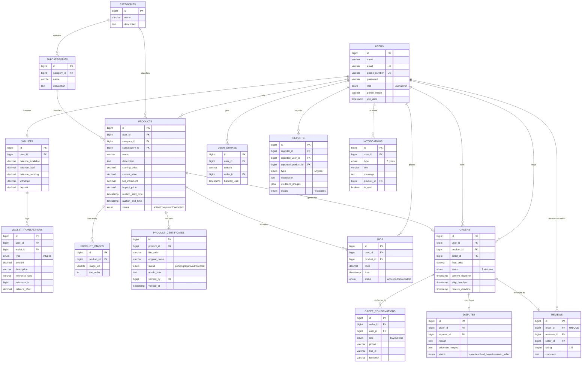
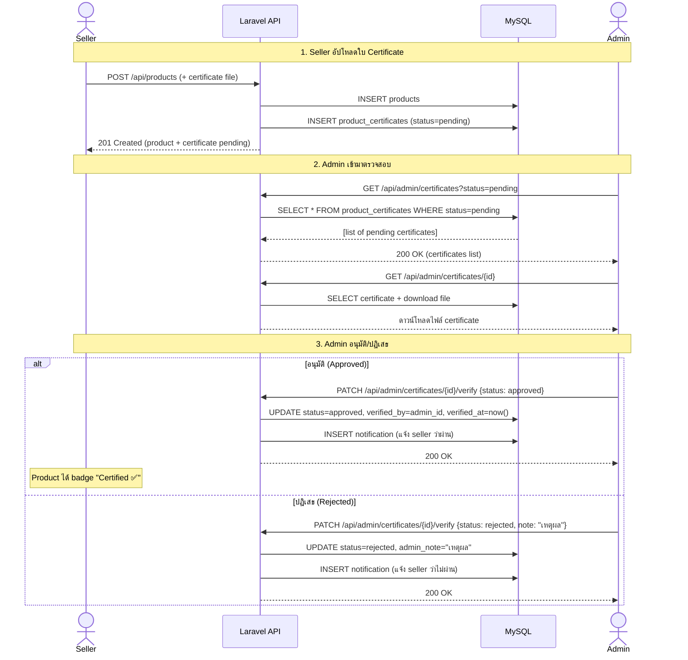
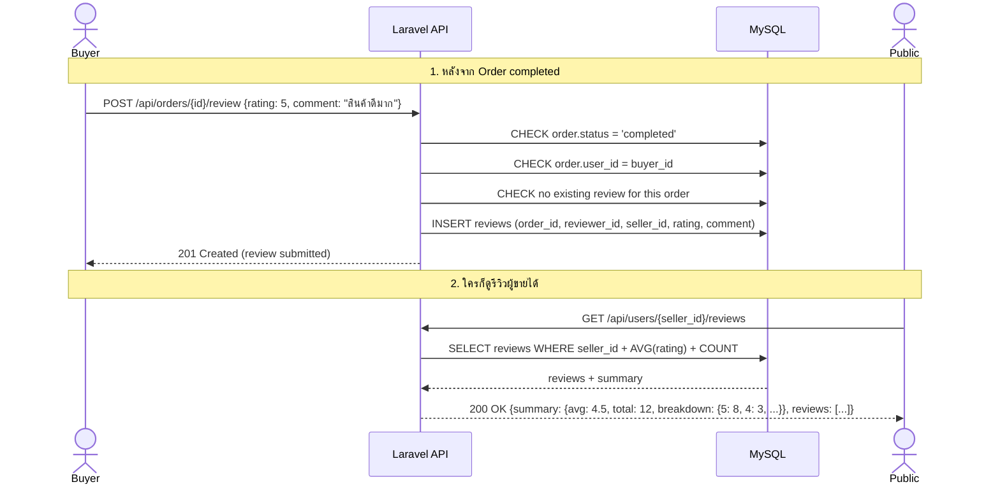
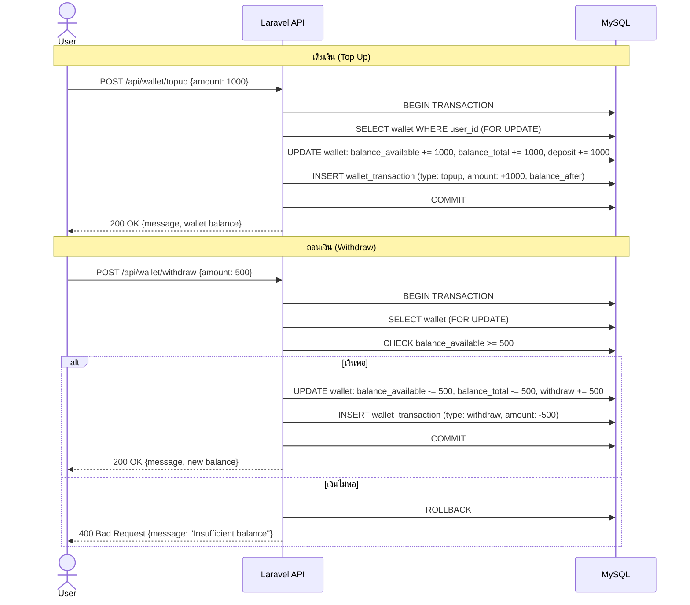
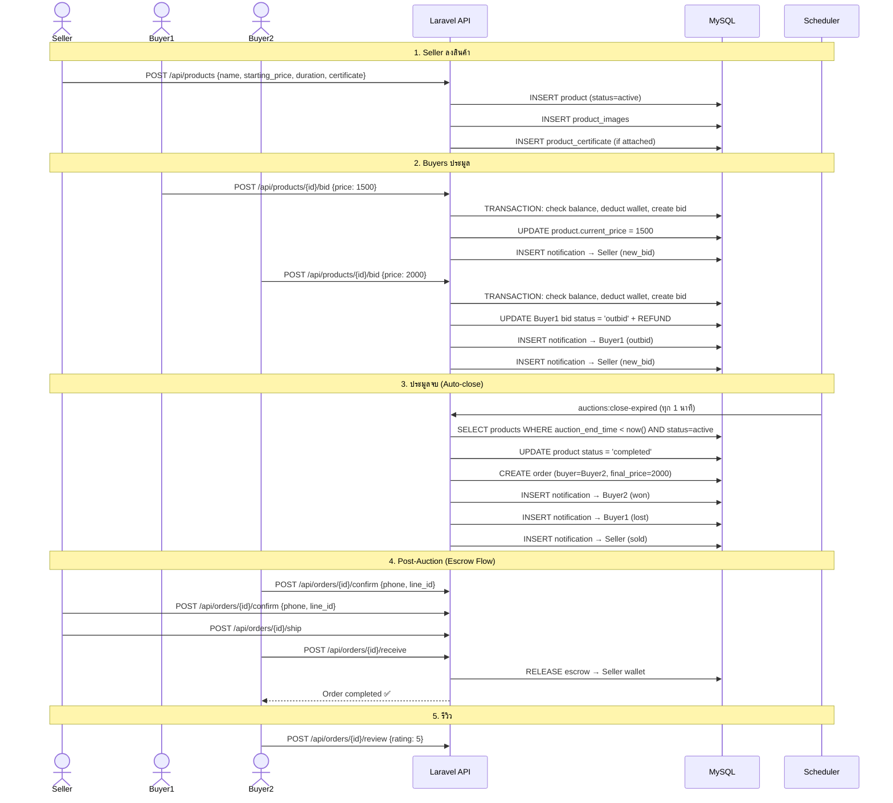
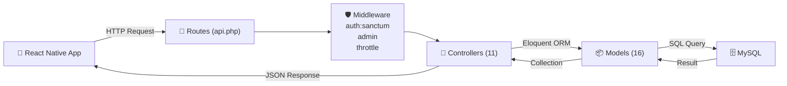
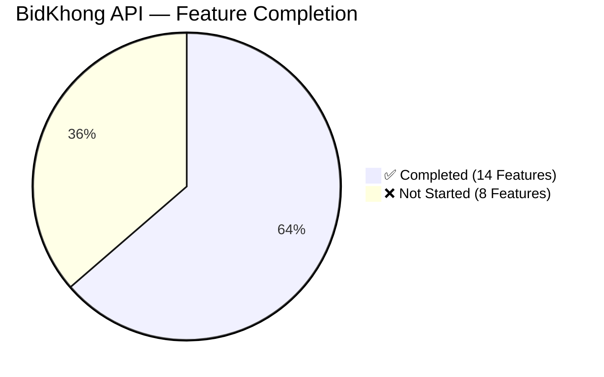

# 📊 BidKhong Auction Platform — Project Presentation

**Framework:** Laravel 12 · **Database:** MySQL 8.0 · **Auth:** Laravel Sanctum  
**วันที่นำเสนอ:** 22 กุมภาพันธ์ 2026

---

## 📌 ที่มาของโปรเจค (Background)

**ปัญหา:** ตลาดซื้อขายของสะสม/มือสองในไทยขาดแพลตฟอร์มประมูลออนไลน์ที่น่าเชื่อถือ — ปัญหาสินค้าปลอม, การฉ้อโกง, ไม่มีระบบ escrow ป้องกันผู้ซื้อ

**วัตถุประสงค์:** พัฒนา RESTful API สำหรับแพลตฟอร์มประมูลออนไลน์ที่มีระบบ:
1. **ประมูลเรียลไทม์** — bid, buy-now, auto-close
2. **ระบบ Wallet & Escrow** — กันเงิน, คืนเงิน, ป้องกันการฉ้อโกง
3. **ใบรับรองสินค้า (Certificate)** — admin ตรวจสอบความเป็นของแท้
4. **รีวิว & คะแนนผู้ขาย** — เพิ่มความน่าเชื่อถือ
5. **ระบบ Report & Dispute** — แจ้งปัญหา, ตัดสินข้อพิพาท

---

## 🛠 เครื่องมือที่ใช้ (Tech Stack)

| ด้าน | เครื่องมือ | เหตุผล |
|------|-----------|--------|
| **Backend Framework** | Laravel 12 (PHP 8.2) | MVC, Eloquent ORM, Migration system |
| **Database** | MySQL 8.0 | ACID transactions, FK constraints, ENUM |
| **Authentication** | Laravel Sanctum | Token-based API auth, lightweight |
| **Containerization** | Docker + Docker Compose | Environment consistency |
| **API Testing** | Postman Collection | 50+ test cases |
| **Version Control** | Git + GitHub | Collaboration |
| **Design** | Figma (Frontend) | UI/UX mockups |
| **Frontend** | React Native + Expo | Cross-platform mobile app |
| **Documentation** | Markdown + Mermaid | ER diagrams, sequence diagrams |

---

## 📈 การพัฒนา (Development Progress)

### ✅ สิ่งที่ทำแล้ว (Completed Features)

| # | ระบบ | Endpoints | สถานะ | รายละเอียด |
|---|------|-----------|-------|-----------|
| 1 | 🔐 Authentication & Profile | 9 | ✅ เสร็จ | Register, Login, Logout, Profile, Change Password, Forgot/Reset Password |
| 2 | 📦 Product Management | 5 | ✅ เสร็จ | CRUD, Multi-image (max 8), Search/Filter/Sort |
| 3 | 📂 Categories & Subcategories | 3 | ✅ เสร็จ | 6 หมวดหลัก, 36 หมวดย่อย |
| 4 | 🔨 ระบบประมูล (Bidding) | 4 | ✅ เสร็จ | Bid, Buy Now, Bid History, Auto-outbid refund |
| 5 | 💰 ระบบ Wallet (เติม/ถอนเงิน) | 3 | ✅ เสร็จ | Topup, Withdraw, Transaction History |
| 6 | 🛒 ระบบ Orders | 3 | ✅ เสร็จ | My Orders, Close Auction, Verify Order |
| 7 | 🤝 Post-Auction (Escrow) | 5 | ✅ เสร็จ | Confirm → Ship → Receive, Dispute |
| 8 | 🔔 Notifications | 4 | ✅ เสร็จ | 7 ประเภทแจ้งเตือน |
| 9 | 📝 Reviews (รีวิวผู้ขาย) | 2 | ✅ เสร็จ | ให้คะแนน 1-5, ดูรีวิวผู้ขาย + สรุปคะแนน |
| 10 | 🏅 Product Certificate | 3 | ✅ เสร็จ | Upload ใบเซอร์, Admin ตรวจ, อนุมัติ/ปฏิเสธ |
| 11 | 🚨 Report System | 2 | ✅ เสร็จ | แจ้งเตือนผู้ใช้/สินค้า + หลักฐาน |
| 12 | 🛡 Admin Panel | 8 | ✅ เสร็จ | Dashboard, Reports, Disputes, Users, Certificates |
| 13 | ⏰ Auto-close Auctions | Scheduler | ✅ เสร็จ | ปิดประมูลอัตโนมัติทุก 1 นาที |
| 14 | 🔒 Security & Rate Limiting | Middleware | ✅ เสร็จ | Rate limit, IDOR protection, DB transactions |

**รวม:** 51 API Endpoints · 15 Application Tables · 16 Models · 11 Controllers · 26 Migrations

---

### 🔄 สิ่งที่ยังอยู่ระหว่างพัฒนา / ยังไม่ได้ทำ

| # | Feature | สถานะ | หมายเหตุ |
|---|---------|-------|---------|
| 1 | 💳 Payment Gateway จริง (PromptPay, QR) | ❌ ยังไม่ได้ทำ | ปัจจุบันเป็น simulated — logic พร้อมเชื่อม gateway จริง |
| 2 | 📱 Push Notifications (FCM) | ❌ ยังไม่ได้ทำ | ปัจจุบันเป็น in-app notification เท่านั้น |
| 3 | 💬 ระบบ Chat (buyer-seller) | ❌ ยังไม่ได้ทำ | ยังไม่มี real-time messaging |
| 4 | 🔍 Advanced Search (Elasticsearch) | ❌ ยังไม่ได้ทำ | ปัจจุบันใช้ SQL LIKE |
| 5 | 📊 Seller Analytics Dashboard | ❌ ยังไม่ได้ทำ | ยอดขาย, สถิติสินค้า |
| 6 | 🌐 Social Login (Google, Facebook) | ❌ ยังไม่ได้ทำ | |
| 7 | 📧 Email Verification (confirm email) | ❌ ยังไม่ได้ทำ | มี forgot password แล้ว แต่ยังไม่มี verify email |
| 8 | 🔄 WebSocket (real-time bid updates) | ❌ ยังไม่ได้ทำ | ปัจจุบัน polling แทน |

---

## 🗄 Database Design (เน้น)

### ภาพรวม

| รายการ | จำนวน |
|--------|-------|
| Application Tables | **15** |
| System/Framework Tables | 5 |
| Total Tables | **20** |
| Foreign Keys | **28** |
| UNIQUE Constraints | 4 |
| ENUM Columns | 8 |
| Migration Files | 26 |

---

### ER Diagram (Entity Relationship Diagram)



---

### Sequence Diagram — ระบบ Certificate (Admin ตรวจสอบ)



---

### Sequence Diagram — ระบบรีวิว (Review System)



---

### Sequence Diagram — ระบบ Wallet (เติมเงิน/ถอนเงิน)



---

### Sequence Diagram — ระบบประมูล (Full Auction Flow)



---

## 🏗 สถาปัตยกรรม (Architecture)

### MVC Pattern



### Directory Structure

```
auction-api/
├── app/
│   ├── Http/Controllers/    # 11 Controllers (API Logic)
│   │   ├── AuthController         # Auth + Profile + Wallet
│   │   ├── ProductController      # Product CRUD + Certificate upload
│   │   ├── BidController          # Bidding + Buy Now
│   │   ├── OrderController        # Orders + Close Auction
│   │   ├── PostAuctionController  # Escrow: Confirm/Ship/Receive/Dispute
│   │   ├── CategoryController     # Categories listing
│   │   ├── NotificationController # Notifications
│   │   ├── ReportController       # User Reports
│   │   ├── ReviewController       # Reviews (ให้ + ดูรีวิว)
│   │   └── AdminController        # Admin Panel (all admin APIs)
│   ├── Models/              # 16 Eloquent Models
│   └── Console/             # Scheduler (auto-close auctions)
├── database/
│   ├── migrations/          # 26 migration files
│   └── seeders/             # Test data (14 users, 27 products, 100+ bids)
├── routes/
│   └── api.php              # 51 API endpoints
├── docs/                    # Documentation
└── docker-compose.yml       # Docker setup
```

---

## 🔐 Security Design

| ด้าน | วิธีจัดการ |
|------|----------|
| **Authentication** | Token-based (Laravel Sanctum) — SHA-256 hash ใน DB |
| **Password** | bcrypt hash (cost=10, 60 chars) — irreversible |
| **SQL Injection** | Eloquent ORM (parameterized queries) |
| **IDOR Protection** | ทุก query scope ตาม user_id + role check |
| **Race Condition** | DB::transaction() + Row Locking |
| **Rate Limiting** | 10/60/100 req/min ตาม route group |
| **File Upload** | Validate mime type + max size + private storage |
| **ENUM Validation** | DB ENUM + Application validation 2 ชั้น |

---

## 📐 Database Normalization

| Normal Form | สถานะ | หมายเหตุ |
|-------------|-------|---------|
| **1NF** | ✅ | ทุก column atomic (ยกเว้น JSON สำหรับ evidence_images — intentional trade-off) |
| **2NF** | ✅ | ไม่มี partial dependency (PK เป็น single column `id` ทุกตาราง) |
| **3NF** | ✅ | ไม่มี transitive dependency + Intentional Denormalization 2 จุด |

### Intentional Denormalization

| Column | คำนวณจาก | เหตุผล |
|--------|---------|--------|
| `products.current_price` | MAX(bids.price) | ไม่ต้อง JOIN + aggregate ทุก request |
| `wallets.balance_total` | available + pending | ไม่ต้องคำนวณทุกครั้ง |

---

## 🔑 ระบบ Certificate (เพิ่มความน่าเชื่อถือ)

### Flow การทำงาน

```
Seller Upload Certificate → status: pending
       ↓
Admin Review (GET /admin/certificates)
       ↓
   ┌─────────┐
   │ Approve │ → status: approved → Product badge "Certified ✅"
   └─────────┘
   ┌─────────┐
   │ Reject  │ → status: rejected → แจ้ง seller เหตุผล
   └─────────┘
```

### API Endpoints (Certificate)

| Method | Endpoint | Role | คำอธิบาย |
|--------|----------|------|---------|
| `POST` | `/api/products` | Seller | อัปโหลดใบ certificate พร้อมสร้างสินค้า |
| `GET` | `/api/admin/certificates` | Admin | ดูรายการ certificate ทั้งหมด (filter by status) |
| `GET` | `/api/admin/certificates/{id}` | Admin | ดาวน์โหลด/ดูไฟล์ certificate |
| `PATCH` | `/api/admin/certificates/{id}/verify` | Admin | อนุมัติ/ปฏิเสธ + หมายเหตุ |

### Database Schema (product_certificates)

```sql
CREATE TABLE product_certificates (
    id          BIGINT UNSIGNED AUTO_INCREMENT PRIMARY KEY,
    product_id  BIGINT UNSIGNED NOT NULL,  -- FK → products.id (CASCADE)
    file_path   VARCHAR(255) NOT NULL,     -- path ไฟล์ PDF/รูป
    original_name VARCHAR(255) NOT NULL,   -- ชื่อไฟล์ต้นฉบับ
    status      ENUM('pending','approved','rejected') DEFAULT 'pending',
    admin_note  TEXT NULL,                 -- หมายเหตุจาก admin
    verified_by BIGINT UNSIGNED NULL,      -- FK → users.id (SET NULL)
    verified_at TIMESTAMP NULL,
    created_at  TIMESTAMP,
    updated_at  TIMESTAMP
);
```

---

## ⭐ ระบบรีวิว (Review System)

### คุณสมบัติ

- Buyer ให้คะแนน **1-5 ดาว** + comment หลัง order completed
- **1 order = 1 review** (UNIQUE constraint)
- ดูรีวิวผู้ขาย **ไม่ต้อง login** (public API)
- สรุปคะแนน: average rating, total reviews, rating breakdown

### Database Schema (reviews)

```sql
CREATE TABLE reviews (
    id          BIGINT UNSIGNED AUTO_INCREMENT PRIMARY KEY,
    order_id    BIGINT UNSIGNED NOT NULL,    -- FK → orders.id (CASCADE) + UNIQUE
    reviewer_id BIGINT UNSIGNED NOT NULL,    -- FK → users.id (buyer)
    seller_id   BIGINT UNSIGNED NOT NULL,    -- FK → users.id (seller)
    rating      TINYINT NOT NULL,            -- 1-5 (ใช้ TINYINT เพื่อ AVG ได้ตรง)
    comment     TEXT NULL,
    created_at  TIMESTAMP,
    updated_at  TIMESTAMP
);
```

---

## 💰 ระบบ Wallet (เติมเงิน/ถอนเงิน)

### ประเภทยอดเงิน

| Field | คำอธิบาย |
|-------|---------|
| `balance_available` | เงินที่ใช้ได้ทันที |
| `balance_pending` | เงินที่ถูกกัน (bidding/escrow) |
| `balance_total` | available + pending |
| `deposit` | ยอดเติมสะสม |
| `withdraw` | ยอดถอนสะสม |

### Transaction Types (9 ประเภท)

| Type | ทิศทาง | เมื่อไหร่ |
|------|--------|----------|
| `topup` | +💰 | เติมเงินเข้า wallet |
| `withdraw` | -💰 | ถอนเงินออก (ขั้นต่ำ 100 บาท) |
| `bid_placed` | -💰 | หักเงินตอน bid |
| `bid_refund` | +💰 | คืนเงินตอนโดน outbid |
| `auction_won` | -💰 | หัก pending ตอนชนะ |
| `auction_sold` | +💰 | รับเงินจากการขาย |
| `escrow_hold` | -💰 | กันเงิน escrow |
| `escrow_release` | +💰 | ปล่อยเงินให้ seller |
| `escrow_refund` | +💰 | คืนเงิน (dispute resolved) |

> 💡 **หมายเหตุ:** ปัจจุบันระบบ Wallet เป็น **simulated** — Logic ฝั่ง backend พร้อมเชื่อมกับ Payment Gateway จริง (PromptPay, QR Code) ได้ทันที โดยไม่ต้องแก้ logic เดิม

---

## 📂 หมวดหมู่สินค้า (Categories)

### 6 หมวดหลัก + 36 หมวดย่อย

| หมวดหลัก | หมวดย่อย |
|----------|---------|
| 📱 Electronics | Smartphones, Laptops, Cameras, Audio, Gaming, Accessories |
| 👗 Fashion | Shoes, Bags, Watches, Jewelry, Clothing, Accessories |
| 🎨 Collectibles | Art, Coins, Stamps, Toys, Cards, Memorabilia |
| 🏡 Home & Living | Furniture, Kitchen, Decor, Garden, Tools, Appliances |
| 🚗 Vehicles | Cars, Motorcycles, Bicycles, Parts, Boats, Others |
| 📦 Others | Books, Sports, Music, Antiques, Handmade, Miscellaneous |

---

## 📊 สรุปภาพรวมโปรเจค



### API Endpoints Summary (51 Total)

| กลุ่ม | จำนวน Endpoints |
|-------|----------------|
| Authentication & Profile | 9 |
| Products | 5 |
| Categories | 3 |
| Bidding | 4 |
| Wallet | 3 |
| Orders | 3 |
| Post-Auction (Escrow) | 5 |
| Notifications | 4 |
| Reports | 2 |
| Reviews | 2 |
| Admin Panel | 8 |
| Scheduler | 1 (cron) |
| **Total** | **51** |
